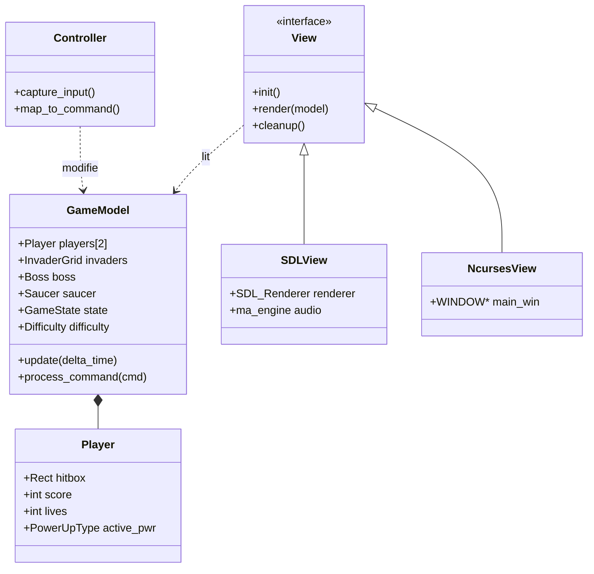
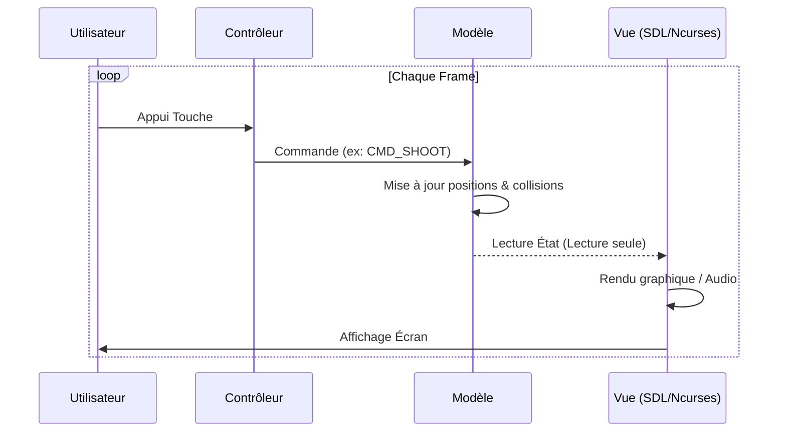

# 1. Introduction

Ce projet consiste en une réimplémentation moderne et robuste du classique *Space Invaders*, développée en langage C. L'objectif principal est de démontrer une architecture logicielle rigoureuse basée sur le patron **Modèle-Vue-Contrôleur (MVC)**. Le jeu offre une expérience multi-plateforme avec deux interfaces distinctes (graphique via SDL3 et textuelle via Ncurses), tout en garantissant une gestion mémoire irréprochable et des mécaniques de jeu avancées comme le mode "Bullet Hell".

# 2. Décisions Techniques

Plusieurs choix technologiques et architecturaux ont été faits pour garantir la performance et la propreté du code :
- **Architecture MVC Stricte** : Le Modèle est totalement indépendant des entrées-sorties. Cela facilite le portage et le test de la logique métier.
- **Gestion Mémoire** : Utilisation systématique de Valgrind pour garantir l'absence de fuites mémoire (standard "Zero Leaks").
- **Double Vue Polymorphique** : Utilisation d'une structure de données permettant de basculer dynamiquement entre SDL3 (rendu GPU) et Ncurses (rendu CPU/Terminal).
- **Moteur Audio Procédural** : Intégration de la bibliothèque `miniaudio` pour une gestion fluide des sons sans bloquer la boucle de jeu principale.

# 3. Diagramme de Classes (Architecture)

Le projet est structuré autour de composants modulaires représentés ici :



# 4. Cas d'Utilisation et Diagramme de Séquence

## 4.1 Cas d'Utilisation (Use Case)

```mermaid
usecaseDiagram
    actor "Joueur" as J
    package "Space Invaders System" {
        usecase "Se Déplacer (P1/P2)" as UC1
        usecase "Tirer" as UC2
        usecase "Gérer la Difficulté" as UC3
        usecase "Mettre à jour la Physique" as UC4
        usecase "Rendre le jeu (SDL/Ncurses)" as UC5
    }
    J --> UC1
    J --> UC2
    J --> UC3
    UC4 ..> UC5 : triggers
```

## 4.2 Diagramme de Séquence (Boucle de Jeu)

Ce diagramme illustre le flux d'une frame, de l'entrée utilisateur au rendu final :



# 5. Difficultés Rencontrées

1.  **Synchronisation Audio/Modèle** : Le Modèle ne devant pas connaître l'audio, la Vue doit détecter les changements d'état (ex: incrément de `shots_fired`) pour déclencher les sons.
2.  **Gestion de la Difficulté "Bullet Hell"** : L'implémentation de tirs simultanés de toutes les colonnes d'ennemis a nécessité une optimisation de la gestion des entités pour éviter tout ralentissement.
3.  **Bordures et Redimensionnement** : Assurer que le HUD reste à `x=600` tout en supportant le redimensionnement de fenêtre SDL3 via une présentation logique (`SDL_LOGICAL_PRESENTATION_LETTERBOX`).

# 6. Conclusion

Ce projet a permis de fusionner des concepts de bas niveau (gestion de la mémoire en C) avec des abstractions architecturales modernes. Le résultat est un jeu complet, fluide et extensible, respectant les standards de l'industrie en matière de séparation des responsabilités et de robustesse technique. La capacité à piloter deux moteurs de rendu radicalement différents avec la même logique métier valide la pertinence du design MVC adopté.
